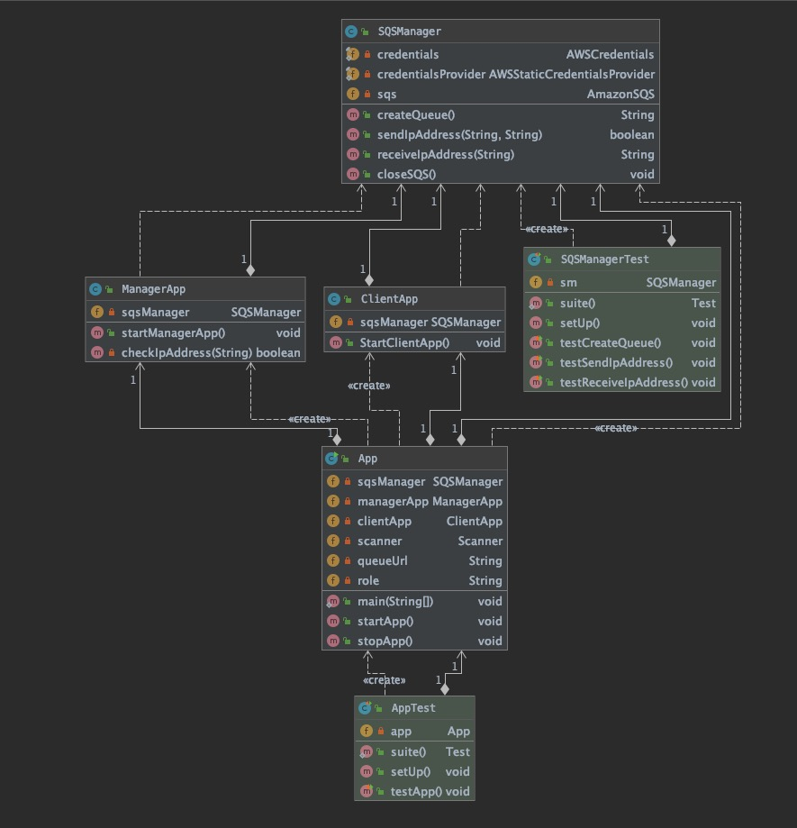
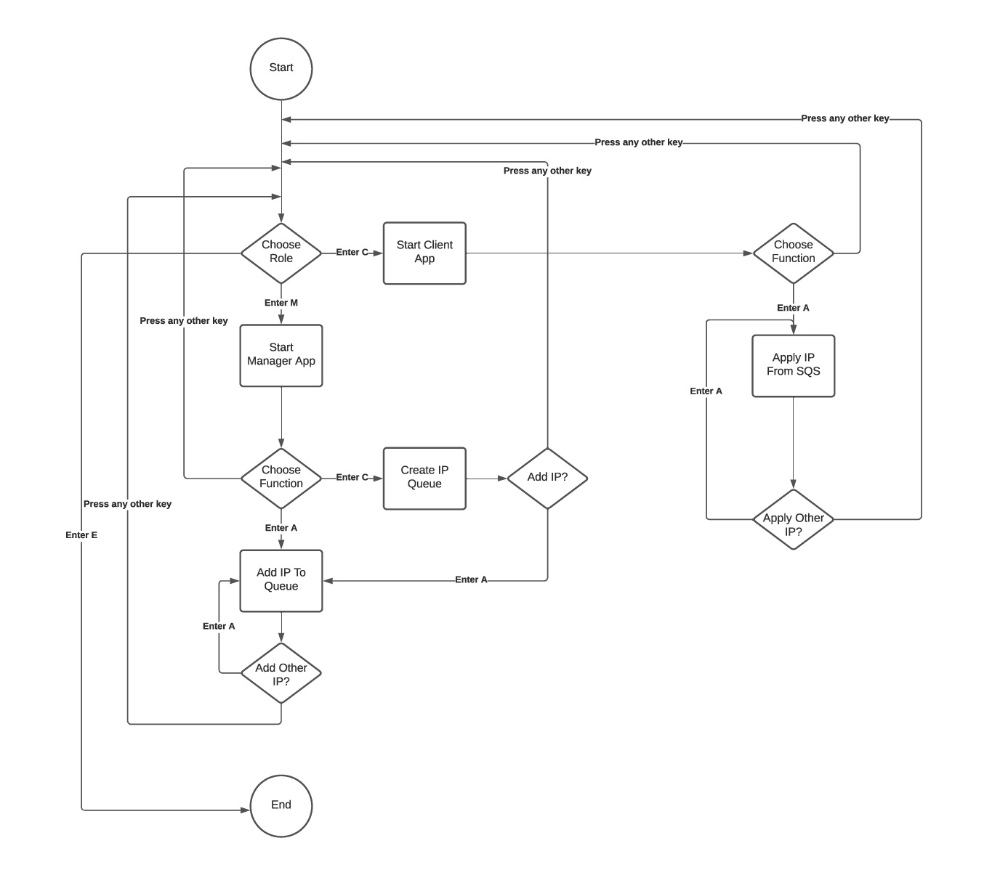

# Simulate Distributed IPAM

## Overview:

In this project, I will leverage a queue service to provide IP addresses in a client/server architecture. Leverage Amazon SQS to return the most recently available IP address.

## Technology:
- Language: Java
- Develop Tool: Intellij IDEA
- Build Tool: Apache maven
- Cloud Service: AWS SQS

## Implement:
- Create an AWS account
-	Create an IAM user (TestSQS) 
- Set permissions (AmazonSQSFullAccess)
-	Get the Access Key ID and the Secret Access Key
-	Configure credentials (In order to Ensure the cloud service are easy to access, I save the credentials in the application)
-	Start to develop the application. 
-	Build a new class called “SQSManager” which is used to communicate with AWS sqs service. The class supports to build Amazon sqs client, create sqs queue, send message, receive message, delete message and close connection.
-	Build a new class called “App” and create an instance of “SQSManager”. 
-	Build a new class called “ManagerApp”. By calling “SQSManager” functions, this class can be used to create sqs queue and add IP address.
-	Build a new class called “ClientApp”. By calling “SQSManager” functions, this class can be used to apply IP address and release IP address.

## Architecture:


## UML:


## Workflow:


## To build the project using Maven:

- Open a terminal and navigate to the project directory IpAddressManagement.
- Use the the following command to build the project
```
mvn package
```

## To run the application
- Use the following command to run the application
```
mvn exec:java -Dexec.mainClass="com.example.IpAddressManagement.App"
```


